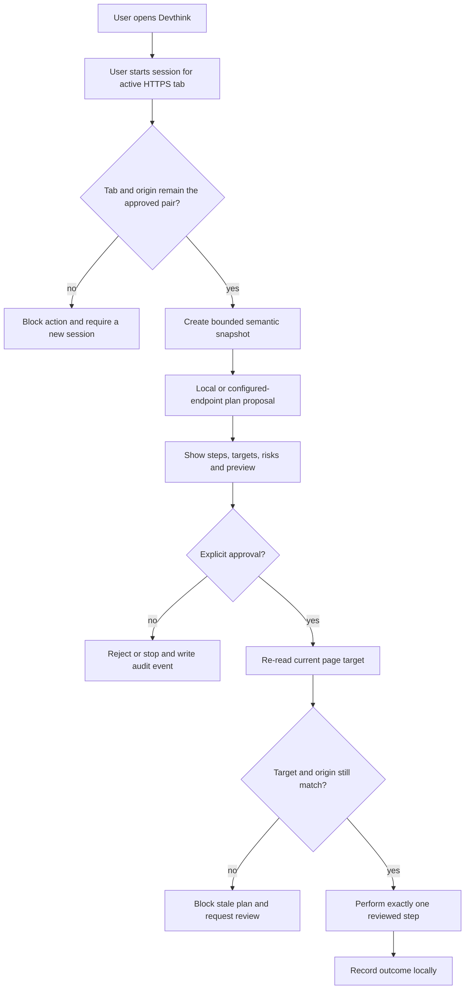

# Devthink Feature Architecture

This architecture translates the public evidence catalogue into an independent, consent-first design. It does not reproduce code, interface, brand identity, workflow formats or protocols from any reference extension. Each capability is implemented as a small, reviewable module with one ownership boundary rather than as one file per browser API.

## Evidence-to-capability decision matrix

| Observed reference capability group | Evidence basis | Devthink response | Default availability |
| --- | --- | --- | --- |
| Page reading, semantic extraction and structured diagnostics | Manifest-verified `activeTab`/`scripting` patterns and non-executing CRX analysis of 57 artifacts. | Capture a bounded semantic snapshot of the currently approved HTTPS tab; expose title, forms, interactive controls and diagnostic counts. | Enabled only after a session is started for the active tab. |
| Visible plan and step review | Public operator and workflow reference descriptions. | Require a human-readable plan, risk label and explicit approval before every action is eligible to run. | Enabled; no step runs during drafting or review. |
| Form assistance and click automation | Publicly declared form-fill and workflow concepts. | Provide a target preview and retain only per-step, same-origin `focus`, `inspect`, `click`, `type` and `navigate` actions. | `type`, `click` and `navigate` are sensitive and require approved plans. |
| Recording, macros, screenshots and scheduled execution | Publicly declared by workflow tools. | Preserve an auditable action history and allow diagnostics; defer recording/replay, screenshots and schedules until separate privacy, retention and permission reviews. | Deferred. |
| Debugger, cookies, downloads, proxy, broad hosts and native companions | Widely observed in manifest evidence, often with `<all_urls>`. | Exclude from the default extension entirely. | Not implemented. |
| Remote model or agent endpoint | Public agent-extension descriptions. | Allow only a user-selected HTTPS endpoint granted through Chromium optional-origin permission; send bounded request data with `credentials: omit`. | Optional and explicit. |

## Devthink execution flow

## Capability modules and tests

| Module | Responsibilities | Invariant | Test evidence |
| --- | --- | --- | --- |
| `policy.ts` | Endpoint normalization, action allowlist, risk classification, pre-execution gate. | No action crosses a session's tab/origin pair; a plan must be approved and unexpired. | Unit tests for expiry, origin drift, navigation and input validation. |
| `extension/pagebridge.ts` | Bounded DOM observation and execution in the approved page. | It refuses origin drift and absent or stale targets. | DOM-like unit tests plus an isolated Chromium smoke test. |
| `extension/background.ts` | Extension-page-only message handling, session lifecycle, audit records and script injection. | No arbitrary webpage or external sender can issue a command. | Sender, session and message-contract tests. |
| `extension/sidepanel.ts` | Human-visible plan, risk and audit review. | Execution controls appear only for approved plans. | Render/interaction tests and browser smoke checks. |
| `extension/popup.ts` | Explicit endpoint-origin grant, session start and stop. | A configured endpoint must be HTTPS and separately permitted. | Policy and browser smoke checks. |

## v1.1.16 implementation scope

Version 1.1.16 adds an **action preview** capability. During review, the user can ask the extension to visibly identify the current target of a `focus`, `inspect`, `click` or `type` step without changing the page's data, navigation, browser state or network traffic. The preview checks the current session, plan expiry, tab, origin and fresh target; it clears automatically before any separately approved execution. This directly supports the observed workflow/review category while keeping the current least-privilege manifest unchanged. Version 1.1.30 makes the corresponding isolated Chromium smoke test robust to dynamic CI debugging ports and MV3's lazy service-worker lifecycle by explicitly allowing only the unpacked Devthink extension, giving that unpacked package a stable public-key-derived identity, starting at `about:blank` only long enough to expose the loopback debugger, checking Devthink's local popup DOM and its real isolated-profile registration, verifying the declared and packaged `background.js` MV3 worker bundle without forcing a suspended worker to remain visible, and using a disposable virtual display plus the official Chrome for Testing binary on the hosted runner, which supports this test path without bypass flags.

> A broad permission appearing in a reference manifest is evidence of a risk surface, not a requirement for Devthink. The package will not implement hidden browsing, credential access, CAPTCHA circumvention, fingerprint evasion, cross-origin navigation, background persistence, native-message bridging or third-party protocol emulation.

## Persistent-agent boundary

An extension does not remain a trustworthy autonomous service after the browser or its profile closes. Any future 24-hour, event-driven agent service must be a separately operated backend with explicit account configuration, retention policy, monitoring and stop controls. It is outside v1.1.16 and cannot inherit browser-session authority from the extension.

## References

[1]: https://developer.chrome.com/docs/extensions/develop/concepts/declare-permissions "Chrome Extensions — Declare permissions"
[2]: https://developer.chrome.com/docs/webstore/update/ "Chrome Web Store — Update protocol"
[3]: https://github.com/nanobrowser/nanobrowser "Nanobrowser public repository"
[4]: https://github.com/AutomaApp/automa "Automa public repository"
