# Flow documentation

Last verified release: the documentation completion release; the doccheck gate renews the verification on every run.

Every execution flow of the release draws in the shared mermaid style: one `flowchart TD` per flow, the reviewed decisions as diamonds, the user gates as doubled borders, the module links below every diagram, and no flow ever depicts an unreviewed path — the consent gates stay explicit at every crossing. The doccheck gate verifies every diagram states its mermaid language and links real modules.

## session lifecycle flow

The lifecycle of one reviewed session from the first proposal to the sealed audit: the session opens on the user proposal, every step crosses the consent gate, and the trail seals at completion.

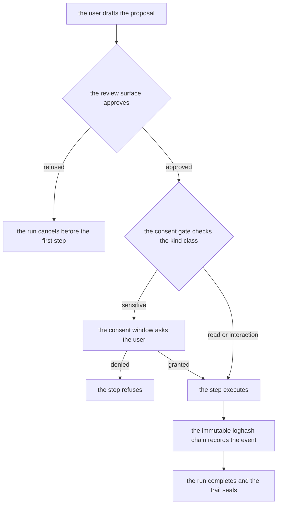

modules: session.ts, gates.ts, run.ts, security.ts

## proposal and review flow

The proposal travels from the plan author to the reviewer: the planlint findings grade the plan, the review surface shows the diff, and the approval gates the execution.

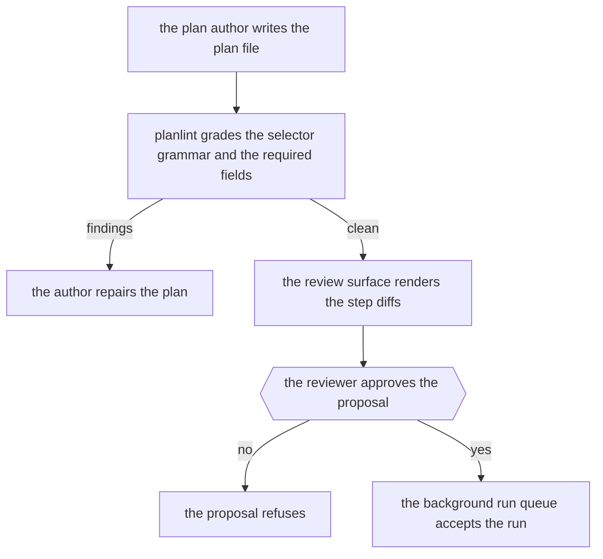

modules: plan.ts, planreview surface of views.ts, gates.ts, workflow.ts

## execution pipeline flow

One step of a reviewed run crosses the pipeline: the kind grades into its risk class, the environment resolves, the idempotency key deduplicates, and the observation records the outcome.

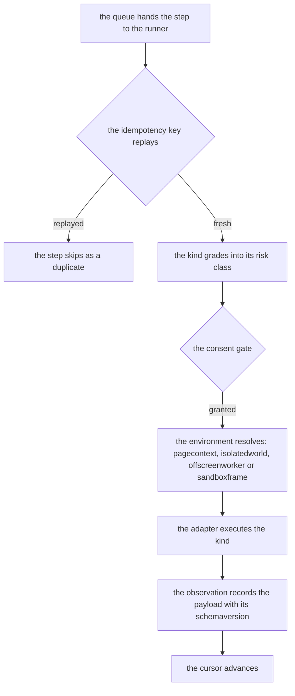

modules: run.ts, environments.ts, runtime.ts, capture.ts, progress of run.ts

## consent gate flow

The consent gate decision tree: the class, the window state, the origin profile and the revocation state answer together.

```mermaid
flowchart TD
  kind[the step kind arrives] --> class[the risk class derives from the fixed allowlist]
  class --> revoked{the consent revoked mid run}
  revoked -- yes --> abort[the in flight step aborts]
  revoked -- no --> window{the consent window holds a live grant}
  window -- expired --> expiry[the grant expired on its timer]
  expiry --> ask{{the user re approves}}
  window -- live --> allow[the step proceeds]
  ask -- denied --> refuse[the step refuses]
  ask -- granted --> allow
```

modules: gates.ts, security.ts, session.ts

## capability negotiation flow

The protocol negotiation between a client and the surface: the highest shared major answers, version one messages pass through the deprecation window, and future majors refuse.

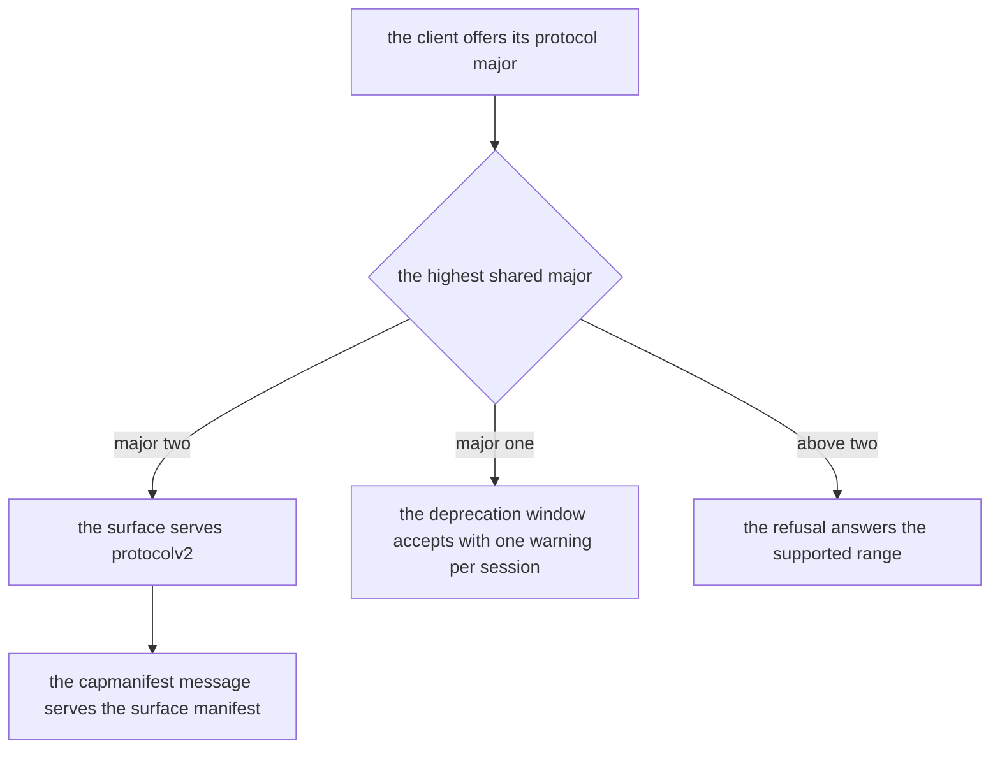

modules: protocol.ts, serve.ts, mcp.ts, gateway.ts

## capture and ocr flow

The capture path from the reviewed shot to the redacted extract: the consent gate, the redaction overlays, the quarantine and the ocr pass.

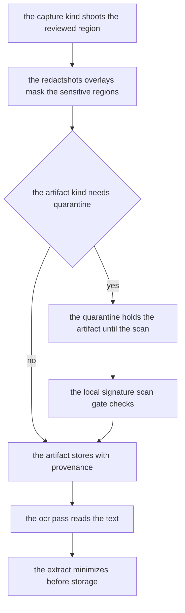

modules: capture.ts, security.ts, export.ts, environments.ts

## network interception flow

The reviewed network path: the origin check, the connect allowlist, the interception rules and the rate limit buckets.

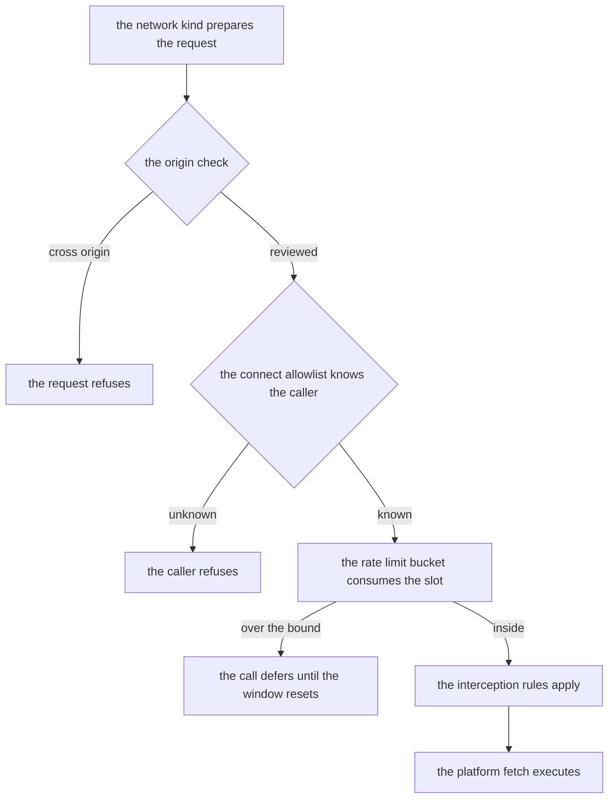

modules: http.ts, security.ts, net.ts

## memory and checkpoint flow

The run state persistence: the checkpoints digest, the resume validation, the memory items with provenance and the expiry.

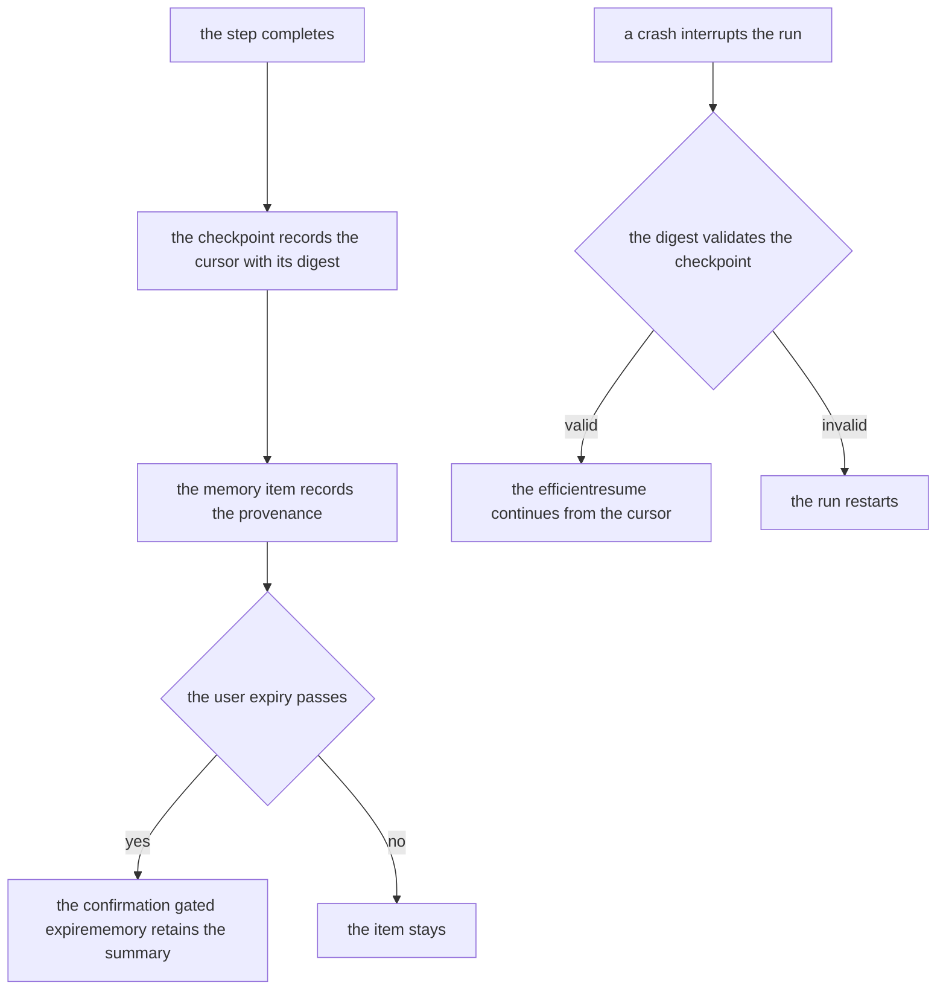

modules: run.ts, memory.ts, session.ts

## workflow engine loop flow

The workflow engine: the composition validates the blocks, the loop control advances, and the triggers schedule the next run.

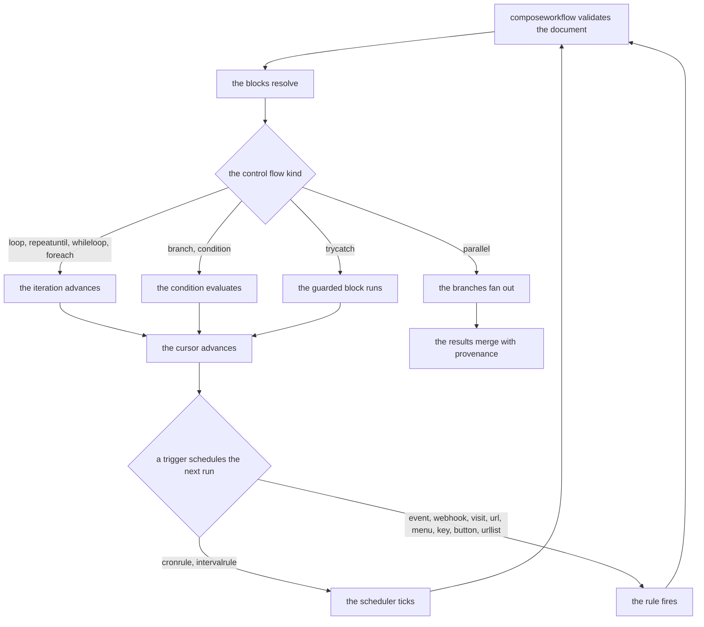

modules: workflow.ts, trigger of workflow.ts, run.ts

## multi agent coordination flow

The coordination topology: the leader delegates through the shared queue, the workers steal within the lock protocol, the critic reviews, and the verifier closes.

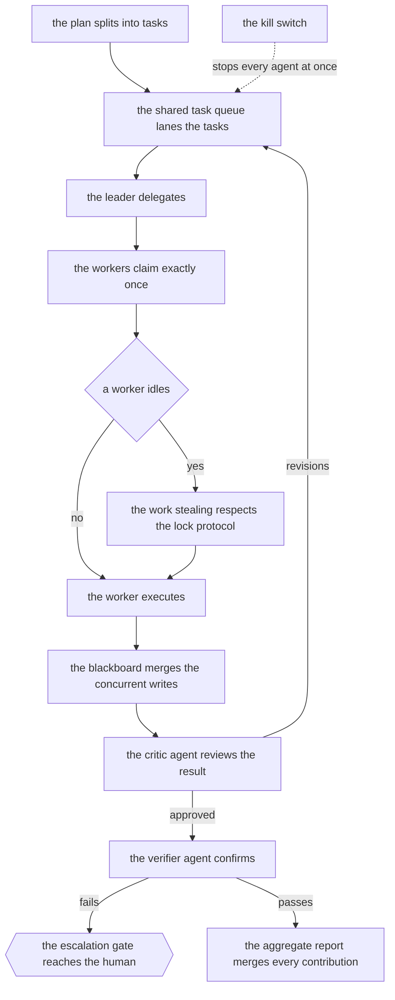

modules: agent.ts, swarm.ts, memory.ts, run.ts

## import and migration flow

The import path of external artifacts: the schema validation, the quarantine, the secret scan and the migration into the reviewed store.

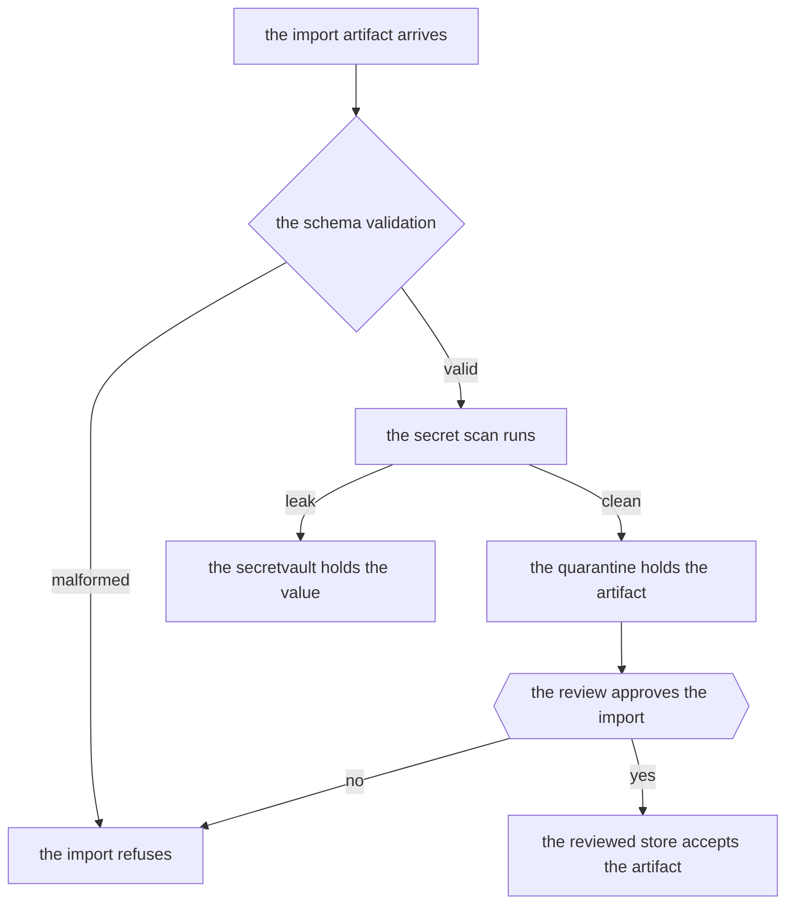

modules: export.ts, security.ts, data.ts, memory.ts

## release pipeline flow

The release chain of the repository: the verify lanes, the assemble, the channels and the checksum verification before the publish.

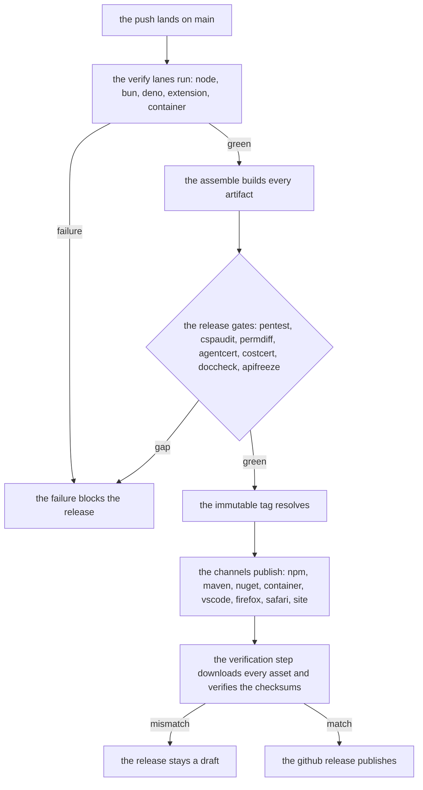

modules: tests/build.mjs, tests/release.mjs, .github/workflows/verify.yml, .github/workflows/release.yml
