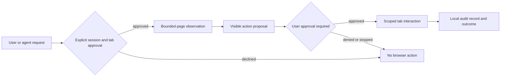

# Public Extension Reference Catalogue

This catalogue records public reference material used to inform Devthink's consent-first design. It does not copy third-party code, visual assets, private protocols or brand identity. A store listing establishes only a publisher claim; package-manifest inspection is recorded separately where a downloadable public artifact was available.

## Evidence classes

| Class | Meaning | Allowed design use |
| --- | --- | --- |
| Store-declared | Feature or privacy statement visible in a public store listing. | Product discovery only; requires independent design and validation. |
| Manifest-verified | Permission, host scope or entrypoint read from a public package manifest. | Threat modelling and least-privilege comparison. |
| Source-verified | Behaviour observed in a lawfully available, suitably licensed source file. | Architectural learning only; never copied into Devthink. |

## Priority public listings

| Reference | Publicly declared version and date | Store-declared capabilities | Safety-relevant claim | Evidence |
| --- | --- | --- | --- | --- |
| [Manus AI Browser Operator][1] | 0.0.61, updated 2026-08-14 | Use a designated tab within a user's logged-in browser context to retrieve information and interact with web applications. | Explicit session authorization, assigned-tab scope and immediate stop by closing the tab. | Store-declared. |
| [Kimi WebBridge][2] | 1.11.6, updated 2026-08-19 | Open pages, click, fill forms, extract information and automate web tasks; task-tab groups can be cleaned up automatically. | The listing declares handling of web history, user activity and website content. | Store-declared. |
| [BrowserAgent][3] | 1.0.10, updated 2025-04-16 | Export and run custom AI-agent workflows locally in the browser. | The listing declares no collection or use of user data. | Store-declared. |
| [WebDex.dev][4] | 1.0.2, updated 2026-06-17 | Side-panel page reading, summaries, form assistance, research, information extraction, workflow assistance and structured reports. | The listing declares handling of personally identifiable information and personal communications. | Store-declared. |
| [Ui.Vision][5] | 10.0.178, updated 2026-08-27 | Local macro recording and replay, form filling, web scraping, screenshots, OCR, image recognition, macro debugging and a command-line interface. | Desktop automation requires a separately installed companion; optional cloud AI is distinct from local processing. | Store-declared. |
| [Automa][6] | 1.30.02, updated 2026-07-23 | Form filling, repetitive-task automation, screenshots, web scraping and user-configured schedule execution. | The listing declares handling of personally identifiable and authentication information. | Store-declared. |

## Additional open-source reference checks

| Reference | Public source evidence | Declared workflow concepts | Devthink boundary |
| --- | --- | --- |
| [Nanobrowser][7] | Public Apache-2.0 repository describing a Chrome extension that runs multi-agent workflows with user-supplied model credentials in the local browser. | Task decomposition, browser-side execution, agent coordination and user-controlled configuration. | Treat credentials as unavailable to the extension by default; retain explicit session approval, origin scope and action confirmation. |
| [Automa source][8] | Public repository describes block-connected workflows for form filling, repetitive tasks, screenshots, scraping and scheduled runs. Its source is variously AGPL or commercial. | Visual workflow composition, recording concepts, data loops and separate Chrome/Firefox build targets. | Do not copy code, workflow formats or commercial components. Scheduling and each browser action must remain visible, cancelable and subject to applicable permission review. |

## Reference flow abstraction

Devthink adopts the consent, tab-scope, visible approval, stop and audit pattern. It does not adopt any covert control, credential collection, CAPTCHA bypass, fingerprint evasion, arbitrary background browsing or undisclosed data transfer. A reference capability remains a design candidate until it has a dedicated threat model, least-privilege permission analysis, implementation plan and automated test.

## Relationship to existing evidence

The repository also contains a file-by-file public artifact inventory covering **67** reviewed Chrome extension IDs: **62** public CRX manifests were successfully read without executing code, while five responses were not a downloadable CRX payload (one store artifact and four update-service HTTP 404 results). The v1.1.31 intake added Selenium IDE, Instant Data Scraper, Table Capture, Copyfish OCR and Session Buddy alongside the original 58 entries. The inventory retains each declared name, version, permissions, host scope, service/background declaration, browser API signals and archive file listing. Separate static and transport matrices record permission prevalence, browser namespaces and possible local/network boundaries.

| Observed evidence group | Examples from the 57 manifest-verified packages | Design consequence for Devthink |
| --- | --- | --- |
| Selected-tab interaction | `activeTab`, `tabs`, `scripting`, side panel and runtime message signals. | Keep commands bound to an explicitly approved tab and origin. |
| Broad browser control | `debugger`, `<all_urls>`, cookies, history, downloads or proxy permissions. | Do not request these by default; require a dedicated threat model and opt-in review. |
| Lifecycle and user feedback | Alarms, notifications, tab groups, commands and offscreen tasks. | Treat scheduling and background work as visible, cancellable proposals rather than silent execution. |
| Local companion boundary | `nativeMessaging` and native-host transport signals. | Keep companion processes outside the default extension; no automatic installation or external-message bridge. |
| Data and productivity operations | Form assistance, page reading, extraction, recording, screenshots, reports and macro concepts. | Decompose into separately approved observation, proposal, action and audit capabilities. |

Those records are being normalized into this flat `docs/` layout. The entries above provide readable, source-linked summaries; they do not replace the raw manifest evidence or inflate public descriptions into implementation facts.

## References

[1]: https://chromewebstore.google.com/detail/manus-ai-browser-operator/cecngibhkljoiafhjfmcgbmikfogdiko "Manus AI Browser Operator — Chrome Web Store"
[2]: https://chromewebstore.google.com/detail/kimi-webbridge/fldmhceldgbpfpkbgopacenieobmligc "Kimi WebBridge — Chrome Web Store"
[3]: https://chromewebstore.google.com/detail/browseragent-ai-agents-in/jphkkablogbfneefecondchaafbdaomc "BrowserAgent — Chrome Web Store"
[4]: https://chromewebstore.google.com/detail/webdexdev-ai-browser-agen/celalggclffbgnloepbfadhjhmchikoh "WebDex.dev — Chrome Web Store"
[5]: https://addons.mozilla.org/en-US/firefox/addon/rpa/ "Ui.Vision — Firefox Browser Add-ons"
[6]: https://chromewebstore.google.com/detail/automa/infppggnoaenmfagbfknfkancpbljcca "Automa — Chrome Web Store"
[7]: https://github.com/nanobrowser/nanobrowser "Nanobrowser — GitHub"
[8]: https://github.com/AutomaApp/automa "Automa — GitHub"

## The schema artifact inventory since 1.1.91

The 1.1.91 api freeze adds a versioned artifact inventory beside the evidence records: the ten frozen schema files under `schemas/` (session, proposal, plan, observation, envelope, capability, audit, memory, progress and tool — each carrying the protocolv2 id and a frozen semantic version), the seven capability manifests under `caps/` (background, pagebridge, sidepanel, popup, cli, library and mcp — each pinned to the release version and the frozen protocol major two) and the freeze artifact `tests/artifacts/apifreeze.json` (the release, the freeze date, the scope, the surface sizes and the sha256 hash of every frozen schema and contract list). The `tests/apifreeze.mjs` gate verifies the inventory on every release and refuses a changed hash without a version bump, `pnpm apifreeze:sync` rewrites the manifests and the artifact after a release bump, and `devthink describe --format json` prints the served manifests beside the freeze scope record. The schema shapes document the same wire the frozen message catalog of `protocol.ts` names, so a client implements the protocol from the schemas and the catalog alone — see `docs/apifreeze.md` and `docs/capmanifest.md`.

## The security artifact inventory since 1.1.95

The 1.1.95 security hardening release adds its own versioned artifact inventory beside the schema inventory: the three gate scripts under `tests/` (pentest.mjs executing the twenty one entry automated checklist against the real compiled modules, cspaudit.mjs auditing every content security policy and every built bundle, and permdiff.mjs comparing the permission set against the previous release artifact with the justification table requirement), the two deterministic gate artifacts under `tests/artifacts/` (pentest.json recording every executed entry with its family, module, outcome and detail, and permdiff.json recording the release diff with the permission set hash — both timestamp free so reruns stay byte identical), the hardening family module `hardening.ts` shipping as its own `dist/hardening.js` entry beside the frozen index surface, and the four security documents (docs/pentest.md with the checklist and its manual half, docs/cspaudit.md with the policy set and the audit rules, docs/transparency.md with the page contents, and docs/securityreview.md with the findings, the per surface results, the permdiff history since the 1.1.31 baseline, the residual risks with their owners and the go decision security entry). The gates run on every release through the `validate:security` chain of package.json, the verify workflow steps and the chromium smoke run, and the permdiff justification table of docs/01.extensionpermissions.md carries the written record every permission addition needs.

## The certification artifact inventory since 1.1.96

The 1.1.96 multi agent certification release adds its own artifact inventory beside the schema and security inventories: the two gate scripts under `tests/` (agentcert.mjs executing the thirty entry coordination checklist against the real compiled modules in the fake clock mode with the fake tab provider covering every browser kind, and costcert.mjs replaying the recorded runs and recomputing every cost line of the shared accounting), the two deterministic gate artifacts under `tests/artifacts/` (agentcert.json recording every executed entry with its family, module, outcome and detail beside the clock mode, the fake tab kinds and the pool coverage of 469 through 502, and costcert.json recording every accounting check with its outcome and detail — both timestamp free so reruns stay byte identical), the two artifact tests (tests/agentcert.test.ts and tests/costcert.test.ts verifying the artifacts cover every scenario, running the gates themselves when a built tree carries no fresh artifact of the current release), the dashdone family module `dashdone.ts` shipping as its own `dist/dashdone.js` entry with its declaration beside the frozen index surface, and the four certification documents (docs/agentcert.md with the checklist and the pool mapping, docs/agentscenarios.md with the six certified topologies and their diagrams, docs/dashdone.md with the dashboard panels, and docs/costcert.md with the accounting verification method). The gates run on every release through the `validate:agents` chain of package.json, the verify workflow steps and the chromium smoke run (which executes the leader worker topology scenario end to end), and the release gates doc of docs/releasegates.md carries the required set entry.

## The release candidate artifact inventory since 1.1.99

The 1.1.99 release candidate adds its own artifact inventory beside the schema, security and certification inventories: the four gate scripts under `tests/` (sweep.mjs collecting the audit trail failures and scanning the source defect classes with the runtime checks, poolaudit.mjs cross referencing the 626 item feature pool of the crx mining evidence against the shipped symbol corpus, matrixverify.mjs enumerating the candidate matrix cells from the kind catalog over the fake tabs of every browser kind to the standing gates, and telemetryfree.mjs proving the network call site inventory, the gated path table and the zero outbound attempts behind the block all proxy), the four deterministic gate artifacts under `tests/artifacts/` (sweep.json recording every finding with its family and status, poolcoverage.json recording the per item pool disposition with the per group counts, matrixverify.json recording every cell outcome with the coverage percentage, and telemetryfree.json recording the call sites, the paths with their gates and the proxy attempts — all timestamp free so reruns stay byte identical), the two artifact tests (tests/sweep.test.ts and tests/matrixverify.test.ts verifying the artifacts cover every family, running the gates themselves when a built tree carries no fresh artifact of the current release), the notes assembly of tests/release.mjs merging the chain section into docs/releasenotes.md, and the three candidate documents (docs/releasecandidate.md with the gate table and the rc1 results, docs/perfbudgets.md with the measured bundle budgets and the runtime ceilings, and the release candidate rows of docs/releasegates.md). The gates run on every release through the `validate:candidate` chain of package.json and the verify workflow steps, and the workflowcheck permitted set carries every candidate gate.

## The example gallery artifact inventory since 2.0.0

The 2.0.0 example gallery adds its own artifact inventory beside the schema, security, certification and candidate inventories: the 36 recipe plan files under `tests/code/recipes/` (pure plan documents the frozen plan grammar owns — 8 scraping, 9 forms, 8 testing, 6 monitoring and 5 agent recipes), the one gallery index `tests/code/recipes/gallery.json` (the metadata the recipes runner and the packaging read: the category, the difficulty, the fixture page, the expected duration, the capabilities, the consent classes, the kinds and the category fields of export format, schedule and topology), the four self contained fixture pages under `tests/code/pages/` (product-grid.html, checkout.html, dashboard.html and feed.html with their local fixture origins), the gate script `tests/recipes.mjs` (loading every recipe through the same cli loader the planlint command uses, validating it against the frozen plan schema, linting it under the portable rule set with the cli capability set, proving the consent gates in both directions, statically resolving every selector against the named fixture page, dry running every entry through the runflow pipeline, replaying the cli planlint command over the built copies and exiting nonzero on any failure, with the diff mode refusing a gallery drift between releases), the gate artifact `tests/artifacts/recipes.json` (recording the outcome, the step count, the gate count and the measured duration of every executed entry beside the per check outcomes — the durations stay live measurements, every other half replays deterministically at the fixed epoch), the artifact test `tests/recipes.test.ts` (verifying the artifact covers every gallery entry with passing outcomes and re-running the gate itself when a built tree carries no fresh artifact of the current release), the build fixtureset rows copying the whole set into `dist/fixtures/recipes/`, `dist/fixtures/pages/` and `dist/gallery.json` so every package channel ships it, the gallery documentation `docs/gallery.md` (the recipe index by category, the format reference, the authoring guide and the troubleshooting per family), and the gallery section of the one design file `web/index.html` (the five category tables of the deployed site). The gate joins the verify lane through its `node tests/recipes.mjs` step so the recipes never drift from the code.
